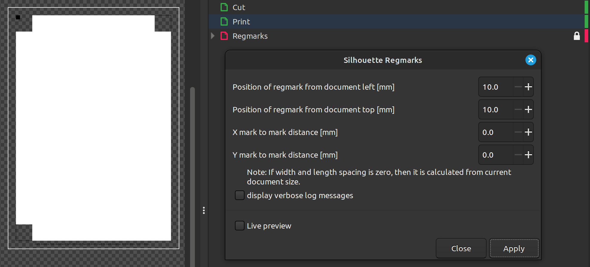
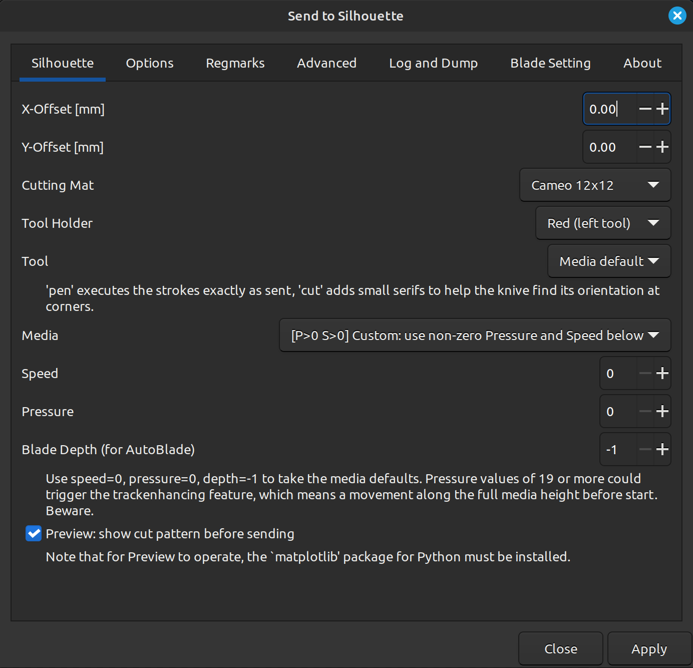
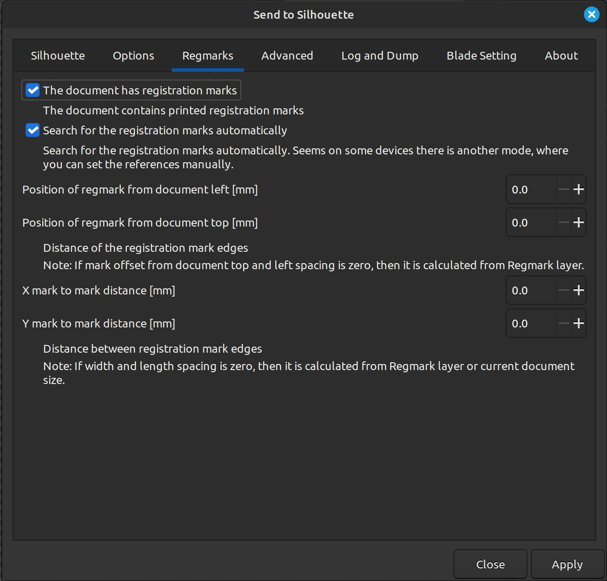

# User Guide

This contains typical usage examples and workflow for users using this plugin.

---

## Prepping new design files


### Adding Print and Cut Layers

You are recommended to add a layer named `Print` and `Cut`.
The `Print` layer in addition to `Regmarks` will be ignored by `Send to Silhouette` extention.


### Add registration mark



The plotter will search the registration marks at the given positions.
If it locates the marks, they will serve as accurate reference and define the origin.
Therefore it is necessary to set the correct offset values of the mark.
As a result the cut will go precisely along the graphics.

1. Extention > Render > Silhouette Regmarks
1. For a Cameo 5 Alpha, select **4 corner (four L-marks, e.g. Cameo 5 Alpha)** as the registration mark style
1. Check regmark from document left and top is set to desired value
1. Set mark to mark distance or clear it to zero if autocalculating from document size
1. Press Apply

This will create a new layer called `Regmarks` with the newly generated registration mark. In a multi-page document, it creates one `Regmarks (page N)` layer on every page.

On the bottom will also be a string shown below that would remind you what settings this was generated with.
- `mark distance from document: Left=10.0mm, Top=10.0mm; mark to mark distance: X=190.0mm, Y=277.0mm;`

Note: You have the option of using the provided template at `examples/registration-marks-cameo-silhouette-a4-maxi.svg` for Silhouette Cameo using A4 paper format. Cameo 5 Alpha users can use the ready-made A4 template at `templates/silhouette-cameo-5-alpha-registration-marks-a4.svg` without running the regmark generator.


---

## Plot



1. Open your document with inkscape.
  - Note: documents in px are plotted at 96dpi
2. Convert text objects to paths (Path - Convert object to path)
3. Select the parts you want to plot.
4. Open the extension. If you want to use the same cut settings for all of the paths in your file, use "Extensions -> Export -> Send to Silhouette." If you want use different cut settings based on the colors of different items in your file, use "Extensions -> Export -> Silhouette Multi Action."
5. In the case of Multi Action, there is a first screen that is primarily for debugging. Typically you can just leave all of the boxes on this unchecked and click "Apply."
6. Set your desired plot parameters. There are numerous aspects you can control with the dialog, here are just the core highlights:
  - **X-Offset, Y-Offset**  An additional offset of your drawing from the top left corner. Default is 0/0
  - **Tool Cut/Pen**        Cut mode drews small circles for orientation of the blade, Pen mode draws exactly as given.
  - **Media**               Select a predfined media or set to custom settings.
  - **Speed**               Custom speed of the movements
  - **Pressure**            Custom Pressure on the blade. One unit is said to be 7g force.
  - Note: In Multi Action, you can select the color you want settings to apply to and then set all the same parameters, but with potentially different settings for each color. You can also change the order in which the colors are cut, and uncheck the box in the "Perform Action?" column to ignore a color altogether.
7. To start the cut, in "Send to Silhouette, click the "Apply" button; in "Silhouette Multi" click the "Execute" button.


### Plot with registration marks steps



1. Open the document which fit to your setup (e.g. With rendered registration mark as illustrated above)
2. Insert your cutting paths and graphics on the apropriate layers.
3. Printout the whole document including registration marks. You probably want to hide the cutting layer.
4. Select your cutting paths in the document, but exclude regmarks and graphics.
  - The extention is smart enough to ignore any layers that has the word `Print` or `Regmarks` in it.
5. On the **Regmarks** tab:
  - Check **Document has registration marks**
  - Check **Search for registration marks**
  - On a Cameo 5 Alpha, also check **Use 4 registration marks**
6. Set all following parameters according to the registration file used:
  - **X mark distance** (e.g. *190*)
  - **Y mark distance** (e.g. *277*)
  - **Position of regmark from document left** (e.g. *10*)
  - **Position of regmark from document top** (e.g. *10*)
  - Note: values are read from regmarks layer if 0 is entered
7. Set desired plot parameters as usual. Already explained in previous section.
8. Start cut.

On some devices have an offset between the search optics and the cutting knife.
For enhanced precision, you may have to set an offset on **X-Offset** and/or **Y-Offset** on the **Silhouette** tab to compensate.

---

## Connecting over Bluetooth

Bluetooth-capable cutters (Cameo 3 and newer, Portrait 2 and newer, Curio 2, and similar) can be driven wirelessly instead of over USB. The extension supports Bluetooth Classic and Bluetooth Low Energy as separate connection types.

### Bluetooth Classic (RFCOMM)

Bluetooth Classic is supported on Linux and Windows. Pair the cutter in the operating system's Bluetooth settings first, then make sure it is powered on and in range.

1. Open **Extensions &rarr; Export &rarr; Send to Silhouette** and switch to the **Bluetooth** tab.
2. Select **Bluetooth Classic (RFCOMM)** as the connection type.
3. Tick **Scan for nearby devices (list, then stop)** and click **Apply**. The extension lists visible devices and stops without plotting. For example:

   ```
   Found 1 Bluetooth Classic device(s):
       00:1B:41:33:44:55   CAMEO 5 ALPHA-000000

   Copy the address of the cutter you want into the 'Bluetooth MAC address' field.
   ```
4. Copy the address into **Bluetooth MAC address** and untick the scan option.
5. Set the plot parameters and click **Apply**.

On Linux the scan uses `bluetoothctl` (BlueZ). Installing PyBluez (`python3 -m pip install pybluez`) additionally enables a live inquiry.

### Bluetooth Low Energy (BLE)

BLE is supported through the optional `bleak` package. The macOS installer installs it automatically; on other systems install it into the Python environment used by Inkscape:

```sh
python3 -m pip install bleak
```

BLE does not require Bluetooth Classic pairing. Make sure Bluetooth is enabled and the cutter is powered on and in range.

1. Open **Extensions &rarr; Export &rarr; Send to Silhouette** and switch to the **Bluetooth** tab.
2. Select **Bluetooth Low Energy (BLE)**. On the first scan, macOS may ask for Bluetooth permission for Inkscape; allow it.
3. Tick **Scan for nearby devices (list, then stop)** and click **Apply**. Scanning intentionally lists every visible BLE device, not only Silhouette cutters.
4. Identify the cutter by its advertised name. The **BLE advertised name** field defaults to `CAMEO`; enter the exact name if more than one device matches.
5. Alternatively, copy the reported **BLE local identifier**. On macOS this is a computer-specific CoreBluetooth UUID, not a portable MAC address.
6. Untick the scan option, set the plot parameters, and click **Apply**.

The extension rejects ambiguous matches rather than choosing an arbitrary nearby device. It detects the cutter model from the firmware after connecting; use **Override cutter model** on the **Log and Dump** tab if the model is not recognised.

The complete Inkscape-to-cutter BLE flow has been verified with Inkscape 1.4.4 on macOS and a Silhouette Cameo 5 Alpha using the pen attachment, including discovery, connection, status checking, setup, and drawing.

### Media check

Before setup or plot commands are sent, the extension queries the cutter status. If no media is loaded—or the status cannot be confirmed—the job exits early, closes the connection, and displays an error. Load the media and run the job again.

### Command-line examples

```sh
# List visible Bluetooth Classic devices, then stop.
sendto_silhouette.py --connection_type=bluetooth --bluetooth_scan=True yourfile.svg

# Plot over Bluetooth Classic using an explicit MAC address.
sendto_silhouette.py --connection_type=bluetooth --bluetooth_addr=00:1B:41:33:44:55 yourfile.svg

# List visible BLE devices, then stop.
sendto_silhouette.py --connection_type=ble --bluetooth_scan=True yourfile.svg

# Plot over BLE using the cutter's advertised name.
sendto_silhouette.py --connection_type=ble --bluetooth_name="CAMEO 5 ALPHA-000000" yourfile.svg

# Select a BLE cutter by a platform-local identifier instead.
sendto_silhouette.py --connection_type=ble --bluetooth_identifier="LOCAL-IDENTIFIER" yourfile.svg
```

---

## Design Tips

### Getting an outline of a vector object

1. Path > Break Apart
1. Path > Union
1. Depening on your sticker cutting requirement:
 - Path > Inset
 - Path > Outset
 - Path > Dynamic Offset


### Getting an outline of a bitmap object

1. Path > Trace Bitmap
  1. Use brightness cutoff detection mode. 
  1. Select threshold to get as much detail of the object in the image.
  1. Press Apply
1. Select all the vector outlines that was detected and generated
1. Path > Break Apart
1. Path > Union
1. Depening on your sticker cutting requirement:
 - Path > Inset
 - Path > Outset
 - Path > Dynamic Offset

 
